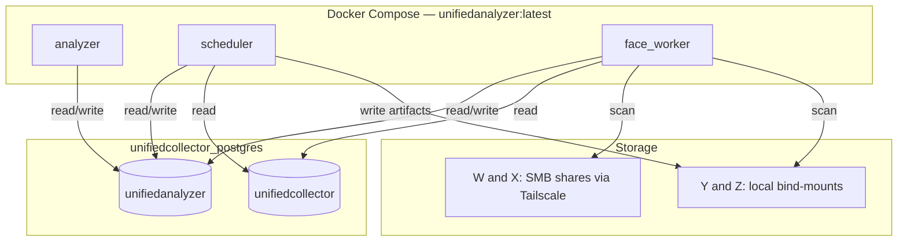

# UnifiedAnalyzer

Personal OSINT analysis engine. Reads the multi-platform firehose collected by
**`unifiedcollector`** and turns it into **resolved identities and intelligence**:
it decides which accounts across every platform belong to the same real person
(an `entity`), builds a unified cross-platform timeline, profiles behavior and
location, indexes faces, and raises alerts.

> Full system walkthrough with architecture, the pipeline phases, the
> identity-signal fusion model, all key workflows, and Mermaid diagrams:
> [`docs/analyzer_overview.md`](docs/analyzer_overview.md)

## What it does

- **Entity resolution** — clusters platform accounts (Instagram, Telegram, GitHub,
  WhatsApp, TikTok, Threads, X, Strava, YouTube, Lemon8, Facebook) into unified
  `entities` via fuzzy username/name match, shared emails/phones, cross-platform
  links, and face identity.
- **IG/Threads deterministic auto-merge** (Phase 1.5) — a Threads handle matching
  an Instagram handle is a Meta guarantee. Those two accounts auto-confirm as one
  entity, emit a `STRONG/VERIFIED instagram_threads_linked` signal, and skip the
  review queue entirely.
- **Identity-signal fusion** — every analyzer phase emits typed weak
  `identity_signals`; `identity_scorer` fuses them into a single "same person"
  probability per entity pair via noisy-OR, with an optional trained logistic
  regression model for improved precision.
- **Unified timeline** — normalizes dated items from every platform into
  `timeline_events` (millions of rows).
- **Behavioral and location analysis** — active-hours and timezone profiles, geo
  inference, cross-platform stylometry, contact extraction, Strava home-base, and
  group co-occurrence graphs.
- **Phase-6 media analysis** — per-media EXIF / OCR / pHash / PDF-text /
  video-frame extraction plus InsightFace face detection, written to
  `media_analysis`.
- **Face engine** — `face_worker` indexes faces from collector media and from the
  W:/X:/Y:/Z: drives into the `facetracker` schema.
- **Alerts** — silence-gap, new-activity-after-silence, coordinated-posting, and
  profile-change events write to `alerts` and push Telegram notifications.
- **Telegram merge bot** — the scheduler pushes inline-keyboard cards for
  high-confidence merge candidates. Two buttons ([Same person] / [Not same
  person]) call the analyzer API directly. Resolved cards are unpinned
  automatically; stale cards after a scheduler restart receive an explicit notice.

  The bot handles button callbacks on an owned background thread so synchronous
  analysis cannot delay acknowledgements. Repeated presses share one in-flight
  decision; failed decisions retain their pinned retry card. Docker routes these
  actions through `ANALYZER_INTERNAL_API_URL=http://analyzer:8002`. Callback overload
  receives bounded, concurrent busy feedback. Graceful scheduler termination waits
  for active decision writes before closing database pools.
- **Self-hosted identity graph** — sigma.js and graphology WebGL graph at
  `/graph`. Two modes: entity relationship graph and Telegram network (reply,
  react, forward edges from `entity_interactions`).
- **Enrichment inflow** — `recon_bridge` reads `collector.recon_observations`
  (maigret, phone lookups, ghunt) on a scheduler tick and emits weak
  `cross_platform_link` and related identity signals (confidence 0.5 or below).

## Architecture

Three long-running Docker processes share the same `unifiedcollector_postgres`
server on the external `unifiedcollector_default` network:



| Service | Command | Role |
|---|---|---|
| **analyzer** | `python -m src.main serve` | FastAPI API + bundled React dashboard on **port 8002** (`RUN_SCHEDULER=0`) |
| **scheduler** | `python -m src.main scheduler` | Analysis pipeline loop (incremental ~2 h + full ~daily). Runs as a separate process so blocking cv2/ffmpeg/ONNX work never freezes the API. |
| **face_worker** | `python -m src.face_worker loop` | InsightFace over collector media + drive scanning, writing to `facetracker.images/faces` + `public.entity_faces`. |

Derived artifacts (face crops, FAISS index, ONNX models, PDF/video frames) live on
**Z:** (`Z:/unifiedanalyzer/media_derived`). Collector source media is read-only
from `Z:/unifiedcollector/media`. Nothing growing is written to the
space-constrained C: drive.

The scheduler and face_worker containers accept dynamic resource caps via
`ANALYZER_SCHED_MEM`, `ANALYZER_SCHED_CPUS`, and related env vars in
`docker-compose.yml`.

## Run it (Docker)

```bash
cp .env.example .env        # set ANALYZER/COLLECTOR DB URLs; SMB_* for drive scan
# Build + start all three services (the .env supplies CIFS creds for W:/X:):
docker compose -f docker/docker-compose.yml --env-file .env up -d --build
# Dashboard + API:  http://127.0.0.1:8002
```

The schema is applied idempotently on startup. To force a one-off:
`docker exec docker-analyzer-1 python -m src.main schema`.

### Host/dev commands (`python -m src.main ...`)

| Command | Description |
|---|---|
| `serve` | FastAPI server (API only; scheduler is a separate process) |
| `scheduler` | Run the analysis scheduler loop |
| `run` | One incremental analysis cycle |
| `full` | Full identity re-resolution |
| `schema` | Apply database schema (idempotent) |

Face worker (`python -m src.face_worker ...`): `loop` (continuous), `ingest [N]`
(one collector batch), `scan [N]` (one drive-scan batch), or no argument (schema only).

**Identity-scorer calibration** (optional — improves merge precision). The scorer
uses noisy-OR by default; train a logistic regression model to replace it:

```bash
# 1) Export candidate pairs + per-signal features to label (fill label col: 1/0)
docker exec docker-scheduler-1 python -m src.pipeline.identity_calibration export /app/media_derived/pairs.csv
# 2) After labeling ~200 pairs, train (auto-loaded by the scorer next run)
docker exec docker-scheduler-1 python -m src.pipeline.identity_calibration train /app/media_derived/pairs.csv
```

No model present means the scorer falls back to noisy-OR, so this is purely additive.

## Drive face-scanning (W / X / Y / Z)

`face_worker.ingest_drive_media()` walks `DRIVE_SOURCES` and runs the same
InsightFace detect-and-index flow as collector media. Drives are mounted into the
container:

- **Y: / Z:** — local, bind-mounted read-only at `/mnt/y`, `/mnt/z`.
- **W: / X:** — SMB shares on the Tailscale host `Prawn-E14`, mounted as **CIFS
  volumes** (`docker_wdrive` / `docker_xdrive`). Credentials come from the
  gitignored `.env` (`SMB_HOST`, `SMB_USER`, `SMB_PASS`).

⚠️ **C: is deliberately excluded** from `DRIVE_SOURCES` — reading OneDrive
placeholders hydrates them and fills the disk. Never add it. Excluded subtrees
(analyzer's own derived dir, collector media, recycle bins) are set via
`EXCLUDE_PATHS` in the compose file.

## API readiness and framework compatibility

The API requires FastAPI 0.137.2 or newer. Readiness inspects effective paths
through FastAPI's public `iter_route_contexts` API, including nested routers and
prefixes. Missing routes remain unhealthy unless the existing HTTP probe proves
they are served; listing a module in configuration is not proof of a mounted route.

Run the focused route checks with:

```bash
python -m pytest tests/test_route_discovery.py tests/test_readiness_route.py -q
```

GitHub default CodeQL setup provides the automatic security scans. The advanced
workflow remains a deliberate manual fallback after default setup is disabled,
so two scanners do not attempt conflicting uploads. The full Python suite still
requires its existing 100% coverage gate and provisioned integration schemas.

## Integration database fixtures

Python CI uses separate disposable `analyzer_ci` and `collector_ci` databases.
The bootstrap applies Analyzer's committed SQL, Face Tracker's existing ORM
models and Collector's real schema runner. Collector's checkout is pinned to
`2f06425270122dea095bc3321bc802c883b586fe`, the checked schema repair in draft
[Collector #31](https://github.com/hongyime/unifiedcollector/pull/31). This fixture
reference does not deploy Collector; update it deliberately after reviewing a
replacement revision and its bootstrap checks.

To reproduce the setup, use the pinned `src/db` checkout under
`.test-upstream/collector-reviewed` and a local pgvector server with the two
configured database URLs. Run `ANALYZER_CI_SCHEMA_SETUP=1 python -m
scripts.bootstrap_integration_db` before `PYTEST_INTEGRATION_DB_ONLY=1 python -m
pytest tests/`. The helper refuses non-loopback hosts, other database names and
connection-string overrides. It is never a production migration command.

A regression inserts synthetic Analyzer, Face Tracker and Collector records,
replays setup and checks row contents, the migration ledger and database
separation. The full CI coverage requirement remains 100%.

## Local graph summaries

The optional `/api/entities/{entity_id}/nl-summary` endpoint uses the existing
platform links, relationships, and timeline. Database or inference failures
return an explicit `skipped` result instead of an invented summary.

On a CPU-only Windows host, start Ollama with the bounded server configuration:

```powershell
pwsh -NoProfile -File docker/start-graph-ollama.ps1
```

In another shell, provision the small local model:

```powershell
ollama pull qwen2.5:0.5b
ollama create unifiedanalyzer-graph -f docker/Modelfile.graph
```

The startup script stores models on Z:, disables cloud inference and GPU use,
allows one loaded model/request, and unloads idle models immediately. A Windows
logon task can run the script; use normal task priority to avoid starving cold
startup under background load. Set `GRAPH_NL_ENABLED=1`,
`GRAPH_NL_MODEL=unifiedanalyzer-graph`, and
`GRAPH_NL_OLLAMA_URL=http://host.docker.internal:11434` in `.env`, then recreate
the API container. Cold CPU loads may need `GRAPH_NL_TIMEOUT_S=240`; the
`GRAPH_NL_MAX_EDGES`, `GRAPH_NL_MAX_TIMELINE`, and `GRAPH_NL_MAX_LINKS` settings
bound the dossier supplied to the model.

## Database backup verification

Scheduled backups run independently of analysis, with only one backup active
per scheduler. Graceful shutdown waits for that backup's worker to finish.
The dashboard image includes PostgreSQL 16 dump/restore tools to match the
production database version.

Legacy backup defaults exclude derived embedding/text data. For a complete
database archive, explicitly set `ANALYZER_DB_BACKUP_EXCLUDE_TABLE_DATA=` to an
empty value. Archive-list validation alone is not a recovery drill: restore the
complete archive into an isolated PostgreSQL instance with the required
extensions, check its tables/data/indexes, and retain the archive and verification
evidence before removing the disposable instance.

## Frontend dev

```bash
cd frontend && npm install && npm run dev
```

The production build is bundled into the image (`docker/Dockerfile.dashboard`)
and served by the `analyzer` service.

## Docs

- [`docs/analyzer_overview.md`](docs/analyzer_overview.md) — **full system walkthrough** (start here for depth).
- [`docs/media_analysis_plan.md`](docs/media_analysis_plan.md) — Phase-6 media analysis design.
- [`docs/storage_drive_plan.md`](docs/storage_drive_plan.md) — storage layout (derived artifacts on Z:).
- [`docs/facetracker_merge_plan.md`](docs/facetracker_merge_plan.md) — historical: how the facetracker face engine was merged in (the standalone facetracker stack is now retired/wiped).

## License

Apache-2.0. See [LICENSE](LICENSE) and [NOTICE](NOTICE).
