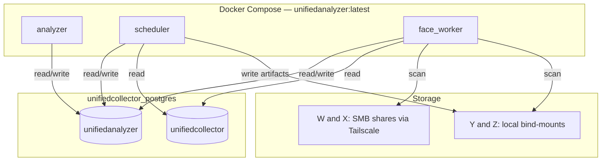

# UnifiedAnalyzer

Personal OSINT analysis engine. Reads the multi-platform firehose collected by
**`unifiedcollector`** and turns it into **resolved identities and intelligence**:
it decides which accounts across every platform belong to the same real person
(an `entity`), builds a unified cross-platform timeline, profiles behavior and
location, indexes faces, and raises alerts.

> Full system walkthrough with architecture, the pipeline phases, the
> identity-signal fusion model, all key workflows, and Mermaid diagrams:
> [`docs/analyzer_overview.md`](docs/analyzer_overview.md)

## What it does

- **Entity resolution** — clusters platform accounts (Instagram, Telegram, GitHub,
  WhatsApp, TikTok, Threads, X, Strava, YouTube, Lemon8, Facebook) into unified
  `entities` via fuzzy username/name match, shared emails/phones, cross-platform
  links, and face identity.
- **IG/Threads deterministic auto-merge** (Phase 1.5) — a Threads handle matching
  an Instagram handle is a Meta guarantee. Those two accounts auto-confirm as one
  entity, emit a `STRONG/VERIFIED instagram_threads_linked` signal, and skip the
  review queue entirely.
- **Identity-signal fusion** — every analyzer phase emits typed weak
  `identity_signals`; `identity_scorer` fuses them into a single "same person"
  probability per entity pair via noisy-OR, with an optional trained logistic
  regression model for improved precision.
- **Unified timeline** — normalizes dated items from every platform into
  `timeline_events` (millions of rows).
- **Behavioral and location analysis** — active-hours and timezone profiles, geo
  inference, cross-platform stylometry, contact extraction, Strava home-base, and
  group co-occurrence graphs.
- **Phase-6 media analysis** — per-media EXIF / OCR / pHash / PDF-text /
  video-frame extraction plus InsightFace face detection, written to
  `media_analysis`.
- **Face engine** — `face_worker` indexes faces from collector media and from the
  W:/X:/Y:/Z: drives into the `facetracker` schema.
- **Alerts** — silence-gap, new-activity-after-silence, coordinated-posting, and
  profile-change events write to `alerts` and push Telegram notifications.
- **Telegram merge bot** — the scheduler pushes inline-keyboard cards for
  high-confidence merge candidates. Two buttons ([Same person] / [Not same
  person]) call the analyzer API directly. Resolved cards are unpinned
  automatically; stale cards after a scheduler restart receive an explicit notice.

  The bot handles button callbacks on an owned background thread so synchronous
  analysis cannot delay acknowledgements. Repeated presses share one in-flight
  decision; failed decisions retain their pinned retry card. Docker routes these
  actions through `ANALYZER_INTERNAL_API_URL=http://analyzer:8002`. Callback overload
  receives bounded, concurrent busy feedback. Graceful scheduler termination waits
  for active decision writes before closing database pools.
- **Self-hosted identity graph** — sigma.js and graphology WebGL graph at
  `/graph`. Two modes: entity relationship graph and Telegram network (reply,
  react, forward edges from `entity_interactions`).
- **Enrichment inflow** — `recon_bridge` reads `collector.recon_observations`
  (maigret, phone lookups, ghunt) on a scheduler tick and emits weak
  `cross_platform_link` and related identity signals (confidence 0.5 or below).

## Architecture

Three long-running Docker processes share the same `unifiedcollector_postgres`
server on the external `unifiedcollector_default` network:


```mermaid
graph TD
    subgraph docker["Docker Compose — unifiedanalyzer:latest"]
        A[analyzer]
        S[scheduler]
        FW[face_worker]
    end
    subgraph pg["unifiedcollector_postgres"]
        UA[(unifiedanalyzer)]
        UC[(unifiedcollector)]
    end
    subgraph drives["Storage"]
        SMB["W and X: SMB shares via Tailscale"]
        LOC["Y and Z: local bind-mounts"]
    end
    A -->|read/write| UA
    S -->|read/write| UA
    S -->|read| UC
    FW -->|read/write| UA
    FW -->|read| UC
    FW -->|scan| SMB
    FW -->|scan| LOC
    S -->|write artifacts| LOC
```

| Service | Command | Role |
|---|---|---|
| **analyzer** | `python -m src.main serve` | FastAPI API + bundled React dashboard on **port 8002** (`RUN_SCHEDULER=0`) |
| **scheduler** | `python -m src.main scheduler` | Analysis pipeline loop (incremental ~2 h + full ~daily). Runs as a separate process so blocking cv2/ffmpeg/ONNX work never freezes the API. |
| **face_worker** | `python -m src.face_worker loop` | InsightFace over collector media + drive scanning, writing to `facetracker.images/faces` + `public.entity_faces`. |

Derived artifacts (face crops, FAISS index, ONNX models, PDF/video frames) live on
**Z:** (`Z:/unifiedanalyzer/media_derived`). Collector source media is read-only
from `Z:/unifiedcollector/media`. Nothing growing is written to the
space-constrained C: drive.

The scheduler and face_worker containers accept dynamic resource caps via
`ANALYZER_SCHED_MEM`, `ANALYZER_SCHED_CPUS`, and related env vars in
`docker-compose.yml`.

## Run it (Docker)

```bash
cp .env.example .env        # set ANALYZER/COLLECTOR DB URLs; SMB_* for drive scan
# Use the isolated dev setup below; create .env.dev/dev-input first.
# Build dev images once, then only when dependency manifests change:
docker compose --env-file .env.dev -f compose.dev.yaml build
docker compose --env-file .env.dev -f compose.dev.yaml up --no-build --pull never
# Dashboard + API:  http://127.0.0.1:8002
```

The schema is applied idempotently on startup. To force a one-off:
`docker exec docker-analyzer-1 python -m src.main schema`.

### Host/dev commands (`python -m src.main ...`)

| Command | Description |
|---|---|
| `serve` | FastAPI server (API only; scheduler is a separate process) |
| `scheduler` | Run the analysis scheduler loop |
| `run` | One incremental analysis cycle |
| `full` | Full identity re-resolution |
| `schema` | Apply database schema (idempotent) |

Face worker (`python -m src.face_worker ...`): `loop` (continuous), `ingest [N]`
(one collector batch), `scan [N]` (one drive-scan batch), or no argument (schema only).

**Identity-scorer calibration** (optional — improves merge precision). The scorer
uses noisy-OR by default; train a logistic regression model to replace it:

```bash
# 1) Export candidate pairs + per-signal features to label (fill label col: 1/0)
docker exec docker-scheduler-1 python -m src.pipeline.identity_calibration export /app/media_derived/pairs.csv
# 2) After labeling ~200 pairs, train (auto-loaded by the scorer next run)
docker exec docker-scheduler-1 python -m src.pipeline.identity_calibration train /app/media_derived/pairs.csv
```

No model present means the scorer falls back to noisy-OR, so this is purely additive.

## Drive face-scanning (W / X / Y / Z)

`face_worker.ingest_drive_media()` walks `DRIVE_SOURCES` and runs the same
InsightFace detect-and-index flow as collector media. Drives are mounted into the
container:

- **Y: / Z:** — local, bind-mounted read-only at `/mnt/y`, `/mnt/z`.
- **W: / X:** — SMB shares on the Tailscale host `your SMB host`, mounted as **CIFS
  volumes** (`docker_wdrive` / `docker_xdrive`). Credentials come from the
  gitignored `.env` (`SMB_HOST`, `SMB_USER`, `SMB_PASS`).

⚠️ **C: is deliberately excluded** from `DRIVE_SOURCES` — reading OneDrive
placeholders hydrates them and fills the disk. Never add it. Excluded subtrees
(analyzer's own derived dir, collector media, recycle bins) are set via
`EXCLUDE_PATHS` in the compose file.

## API readiness and framework compatibility

The API requires FastAPI 0.137.2 or newer. Readiness inspects effective paths
through FastAPI's public `iter_route_contexts` API, including nested routers and
prefixes. Missing routes remain unhealthy unless the existing HTTP probe proves
they are served; listing a module in configuration is not proof of a mounted route.

Run the focused route checks with:

```bash
python -m pytest tests/test_route_discovery.py tests/test_readiness_route.py -q
```

GitHub default CodeQL setup provides the automatic security scans. The advanced
workflow remains a deliberate manual fallback after default setup is disabled,
so two scanners do not attempt conflicting uploads. The full Python suite still
requires its existing 100% coverage gate and provisioned integration schemas.

## Integration database fixtures

Python CI uses separate disposable `analyzer_ci` and `collector_ci` databases.
The bootstrap applies Analyzer's committed SQL, Face Tracker's existing ORM
models and Collector's real schema runner. Collector's checkout is pinned to
`2f06425270122dea095bc3321bc802c883b586fe`, the checked schema repair in draft
[Collector #31](https://github.com/hongyime/unifiedcollector/pull/31). This fixture
reference does not deploy Collector; update it deliberately after reviewing a
replacement revision and its bootstrap checks.

To reproduce the setup, use the pinned `src/db` checkout under
`.test-upstream/collector-reviewed` and a local pgvector server with the two
configured database URLs. Run `ANALYZER_CI_SCHEMA_SETUP=1 python -m
scripts.bootstrap_integration_db` before `PYTEST_INTEGRATION_DB_ONLY=1 python -m
pytest tests/`. The helper refuses non-loopback hosts, other database names and
connection-string overrides. It is never a production migration command.

A regression inserts synthetic Analyzer, Face Tracker and Collector records,
replays setup and checks row contents, the migration ledger and database
separation. The full CI coverage requirement remains 100%.

## Local graph summaries

The optional `/api/entities/{entity_id}/nl-summary` endpoint uses the existing
platform links, relationships, and timeline. Database or inference failures
return an explicit `skipped` result instead of an invented summary.

On a CPU-only Windows host, start Ollama with the bounded server configuration:

```powershell
pwsh -NoProfile -File docker/start-graph-ollama.ps1
```

In another shell, provision the small local model:

```powershell
ollama pull qwen2.5:0.5b
ollama create unifiedanalyzer-graph -f docker/Modelfile.graph
```

The startup script stores models on Z:, disables cloud inference and GPU use,
allows one loaded model/request, and unloads idle models immediately. A Windows
logon task can run the script; use normal task priority to avoid starving cold
startup under background load. Set `GRAPH_NL_ENABLED=1`,
`GRAPH_NL_MODEL=unifiedanalyzer-graph`, and
`GRAPH_NL_OLLAMA_URL=http://host.docker.internal:11434` in `.env`, then recreate
the API container. Cold CPU loads may need `GRAPH_NL_TIMEOUT_S=240`; the
`GRAPH_NL_MAX_EDGES`, `GRAPH_NL_MAX_TIMELINE`, and `GRAPH_NL_MAX_LINKS` settings
bound the dossier supplied to the model.

## Database backup verification

Scheduled backups run independently of analysis, with only one backup active
per scheduler. Graceful shutdown waits for that backup's worker to finish.
The dashboard image includes PostgreSQL 16 dump/restore tools to match the
production database version.

Legacy backup defaults exclude derived embedding/text data. For a complete
database archive, explicitly set `ANALYZER_DB_BACKUP_EXCLUDE_TABLE_DATA=` to an
empty value. Archive-list validation alone is not a recovery drill: restore the
complete archive into an isolated PostgreSQL instance with the required
extensions, check its tables/data/indexes, and retain the archive and verification
evidence before removing the disposable instance.

## Frontend dev

```bash
cd frontend && npm install && npm run dev
```

The production build is bundled into the image (`docker/Dockerfile.dashboard`)
and served by the `analyzer` service.

## Docs

- [`docs/analyzer_overview.md`](docs/analyzer_overview.md) — **full system walkthrough** (start here for depth).
- [`docs/media_analysis_plan.md`](docs/media_analysis_plan.md) — Phase-6 media analysis design.
- [`docs/storage_drive_plan.md`](docs/storage_drive_plan.md) — storage layout (derived artifacts on Z:).
- [`docs/facetracker_merge_plan.md`](docs/facetracker_merge_plan.md) — historical: how the facetracker face engine was merged in (the standalone facetracker stack is now retired/wiped).

## License

Apache-2.0. See [LICENSE](LICENSE) and [NOTICE](NOTICE).

## Isolated container development on Windows, WSL, and Linux

Use the explicit `compose.dev.yaml` on a development host. It creates a separate
`unifiedanalyzer-dev` project with fresh named data volumes and loopback-only ports.
The existing deployment Compose file remains separate. Source reaches dev
containers through bind mounts; Python dependencies live in `/opt/venv`, and an
anonymous volume shields frontend `node_modules` from the host bind mount.

Run from this repository in PowerShell or a Linux shell:

~~~sh
# Prepare local settings/input without reading or overwriting an existing env file:
python -c "from pathlib import Path; Path('.env.dev').touch(exist_ok=True); Path('dev-input').mkdir(exist_ok=True)"
# Initial dev image build; repeat only when dependency manifests/system packages change:
docker compose --env-file .env.dev -f compose.dev.yaml build
# Daily development:
docker compose --env-file .env.dev -f compose.dev.yaml up --no-build --pull never
~~~

Use `python3` if your Linux installation does not provide `python`.
Open the frontend at http://localhost:15173 and API at
http://localhost:18002. Put synthetic development input under `dev-input/`.
The supplied database password is a local development placeholder, not an account
credential; override `DEV_POSTGRES_PASSWORD` in `.env.dev` if needed.
Production `.env`, drive mounts, databases, and data volumes are not inherited.

Python polling reloaders restart application processes after source edits. Vite
uses polling and proxies API/WebSocket traffic over the development network.
This supports Windows and SMB mounts where filesystem events may be absent;
the Docker host must still be able to bind-mount this checkout. Test an edit on
the actual host, or use a host-local clone if its mapped SMB drive is unavailable.
No source edit rebuilds an image or recreates a container.

After a dependency build, refresh **only anonymous dependency volumes**:

~~~sh
docker compose --env-file .env.dev -f compose.dev.yaml up --no-build --pull never --renew-anon-volumes
~~~

Named development database/model/data volumes are retained. Do not use
`down -v` to refresh dependencies. Dev image tags use `pull_policy: never`; a
missing image requires the explicit initial build above.

The API initializes its own development schema. The isolated collector database
starts empty: integration workflows need the collector's development schema and
synthetic seed data. Its absence remains visible as degraded collector features;
no production collector is contacted by default. Point only a deliberately
configured development stack at your integration data.

Workers are opt-in, after development schemas/data are ready:

~~~sh
docker compose --env-file .env.dev -f compose.dev.yaml --profile workers up --no-build --pull never
~~~

The separate stream-alerts profile disables notifications. Worker source edits
restart the worker process and can restart in-progress development jobs.
The dashboard image preserves the existing spaCy NER model; the API-only image
omits that optional model. Runtime compilers are removed, and vendored
WhatsMyName rules are included. The historical Dockerfile.hotfix repair libraries
are now included in the main recipes, so that local repair build is unnecessary.

Production targets are named `production` and publish remotely through
`.github/workflows/docker-publish.yml` on the default branch or manual dispatch.
For an optional production download, run the explicit command:

~~~sh
docker pull ghcr.io/hongyime/unifiedanalyzer/dashboard:latest
~~~

CI emits latest/default-branch and short-SHA tags (semver metadata on version
refs). It builds linux/amd64 with provenance/SBOM disabled and validates every
tagged manifest before retention. Any index, attestation, unknown manifest, or
registry error stops cleanup. Retention keeps the newest three tagged versions
plus latest, and three untagged versions; tagged history is bounded separately.
The package must grant this repository Actions admin access for deletion.
Do not switch these packages to multi-platform publication without revisiting
retention. Image sizes are unknown until CI reports compressed layer sizes;
computer-vision and ML dependencies can exceed the approximate 200 MB target.

Package visibility must be checked on the package itself. Treat 500 MB storage
and 1 GB/month transfer for private packages only as planning assumptions, and
verify current [GitHub billing documentation](https://docs.github.com/en/billing/concepts/product-billing/github-packages).
Downloads using GITHUB_TOKEN inside GitHub Actions do not count against transfer.

### SMB and remote Docker hosts

Use Docker Compose 2.32.2+ and the explicit `compose.watch.yaml` overlay when the
Docker host cannot bind-mount this checkout. These commands work in PowerShell
and Linux shells after preparing the private `.env.dev` described above:

~~~sh
# Explicit initial third-party image acquisition:
docker compose --env-file .env.dev -f compose.dev.yaml pull postgres collector-postgres
# One initial development build; repeat only for dependency/system-package changes:
docker compose --env-file .env.dev -f compose.dev.yaml -f compose.watch.yaml build
# Source edits synchronize into the same running containers:
docker compose --env-file .env.dev -f compose.dev.yaml -f compose.watch.yaml up --no-build --pull never --watch
~~~

The initial dev image includes ordinary source after dependency installation.
Later edits use `sync` only, with no rebuild actions. Source binds and anonymous
dependency/build volumes are removed in this overlay; dependencies remain in
the image. Named development data is retained, and worker/account profiles stay
opt-in. Private filenames and dependency manifests are excluded from Watch.
Verify an edit on the actual SMB client because share event delivery varies.

After stopping Watch, remove only the development containers/networks:

~~~sh
docker compose --env-file .env.dev -f compose.dev.yaml -f compose.watch.yaml down --remove-orphans
~~~

For disposable tests, use `-p unifiedanalyzer-smoke-dev` consistently and add `--volumes`
to that test project's final `down`. Keep the reusable dev images so daily startup
needs no build or pull. Do not delete named volumes containing development data
you want to retain.


The sync overlay uses an empty, dedicated `dev_input` volume instead of mounting
host media. Its collector database still requires synthetic development schema/data
for integration features; no production database is inherited.
