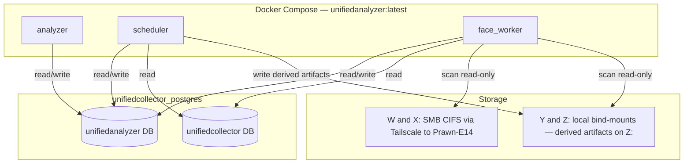
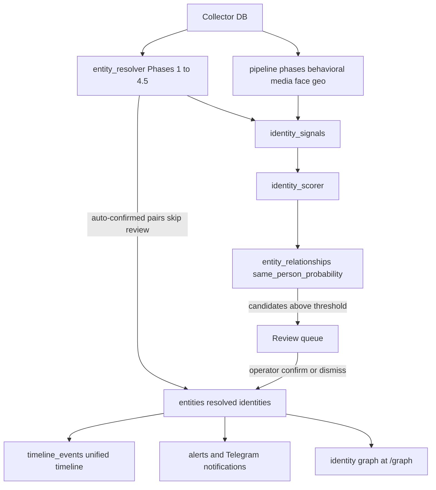
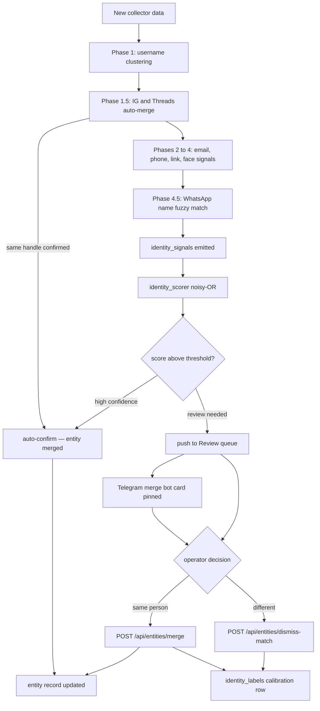
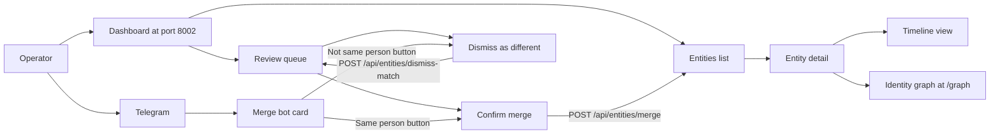
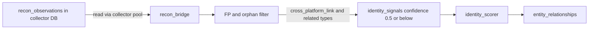

# UnifiedAnalyzer: System Overview

This document is the deep-dive companion to the [README](../README.md). It covers
the full architecture, every pipeline phase, the identity-signal fusion model,
key workflows with diagrams, and current operational details.

---

## Table of contents

1. [Architecture](#1-architecture)
2. [Data flow](#2-data-flow)
3. [Pipeline phases](#3-pipeline-phases)
4. [Identity signals and scoring](#4-identity-signals-and-scoring)
5. [Merge and identity-resolution workflow](#5-merge-and-identity-resolution-workflow)
6. [Operator user flow](#6-operator-user-flow)
7. [IG/Threads deterministic auto-merge (Phase 1.5)](#7-igthreads-deterministic-auto-merge-phase-15)
8. [Telegram merge bot](#8-telegram-merge-bot)
9. [Review queue](#9-review-queue)
10. [Enrichment inflow: recon_bridge](#10-enrichment-inflow-recon_bridge)
11. [Self-hosted identity graph](#11-self-hosted-identity-graph)
12. [Face engine](#12-face-engine)
13. [Alerts](#13-alerts)
14. [Storage layout](#14-storage-layout)
15. [Scorer calibration](#15-scorer-calibration)

---

## 1. Architecture

Three Docker containers share one Postgres server. All processes run from the same
image (`unifiedanalyzer:latest`) and restart unless stopped.



### Services

| Service | Entry point | Ports | Key env vars |
|---|---|---|---|
| **analyzer** | `python -m src.main serve` | 8002 | `RUN_SCHEDULER=0` |
| **scheduler** | `python -m src.main scheduler` | none | `ANALYZER_SCHED_MEM`, `ANALYZER_SCHED_CPUS` |
| **face_worker** | `python -m src.face_worker loop` | none | `DRIVE_SOURCES`, `EXCLUDE_PATHS` |

**analyzer** serves the FastAPI backend and the bundled React SPA. It never runs
the analysis pipeline. Its only blocking work is request handling.

**scheduler** owns the analysis pipeline. It runs incremental cycles roughly every
2 hours and a full re-resolution roughly daily. CPU/memory ceilings are configurable
via `ANALYZER_SCHED_MEM` / `ANALYZER_SCHED_CPUS` in `docker-compose.yml`, which
sets Docker resource caps for the container. The scheduler also hosts the Telegram
merge bot's async long-poll loop as an `asyncio.Task` — no extra process or
container is needed.

**face_worker** runs InsightFace continuously over collector media and over the
mounted drives. It writes to `facetracker.images`, `facetracker.faces`, and
`public.entity_faces`.

### Databases

Both databases live on the same `unifiedcollector_postgres` instance, reached via
the external `unifiedcollector_default` Docker network.

| DB | Owner | Key schemas/tables |
|---|---|---|
| `unifiedcollector` | unifiedcollector | `instagram_profiles`, `telegram_users`, `whatsapp_users`, `github_users`, `tiktok_profiles`, `x_profiles`, `facebook_profiles`, `threads_posts`, `strava_athletes`, `youtube_channels`, `lemon8_profiles`, `social_users`, `media`, `recon_observations` |
| `unifiedanalyzer` | unifiedanalyzer | `entities`, `entity_platform_links`, `identity_signals`, `entity_relationships`, `timeline_events`, `media_analysis`, `alerts`, `facetracker.*`, `entity_faces`, `behavioral_profiles`, `location_evidence` |

---

## 2. Data flow

This diagram shows the high-level path from raw collector data to the three
primary consumer outputs.



The key design principle: **the entity resolver and pipeline phases are producers
of typed weak signals; the scorer is the only consumer that synthesizes them into
a "same person" probability.** Phases never write directly to `entities` except
for the auto-confirmed deterministic cases (IG/Threads, exact-username same-entity
resolution within Phase 1).

---

## 3. Pipeline phases

The scheduler drives two run types: **incremental** (processes only new collector
data since the last run) and **full** (re-resolves all entities from scratch).
Both run the same sequence of phases; the full run clears and rebuilds intermediate
tables before starting.

### Phase 1: Username clustering

`entity_resolver.resolve_entities()` loads profiles from all platform tables and
clusters them by normalized username. Normalization strips trailing digits,
punctuation (`._-`), and case. A username shared by more than 10 accounts is
treated as a common handle and skipped to avoid false merges.

Strict normalization (keeps trailing digits) is used as the clustering key so
`bryanseah` and `bryanseah99` are treated as potentially different people and
surfaced as review candidates rather than auto-merged.

### Phase 1.5: IG/Threads deterministic auto-merge

When an Instagram handle and a Threads handle match after strict normalization,
they are guaranteed to be the same Meta account. The resolver folds them into one
`EntityCandidate` immediately, emits an `instagram_threads_linked` signal at raw
confidence 50.0 (the highest single-signal value in the resolver), and marks them
confirmed. This pair never enters the review queue. See [section 7](#7-igthreads-deterministic-auto-merge-phase-15) for detail.

### Phase 2: Shared email

Profiles sharing a non-generic email address are linked with an `email_match`
signal (weight 0.60).

### Phase 3: Shared phone

Profiles sharing a phone number (E.164 normalized) are linked with a `phone_match`
signal (weight 0.60).

### Phase 4: Cross-platform links

Bios and profile fields containing direct links to other platform accounts are
parsed and matched, emitting `cross_platform_link` signals (weight 0.40).
Shared personal websites emit `shared_website` signals (weight 0.35).

### Phase 4.5: WhatsApp name-only fuzzy match

WhatsApp users have no username; the only available signal is the contact display
name. A name-only link requires a **distinctive** full name (at least 2 tokens,
at least 5 characters) and a fuzzy token-sort ratio of 90 or above. Single
first-name-only matches are rejected outright to reduce false merges.

### Phase 5: Timeline and behavioral analysis

`timeline_builder.build_timeline()` normalizes posts, messages, activity, and
events from all platforms into `timeline_events`. Downstream phases then run over
this unified stream:

- **behavioral_profiler** — active-hour distributions, timezone fingerprint.
- **temporal_correlation** — cross-entity posting-hour similarity signals.
- **content_fingerprint** — cross-platform content similarity (weight 0.30).
- **topical_similarity** — multilingual-e5-small embeddings over timeline titles,
  cosine similarity per entity pair (weight 0.15; context-only signal).
- **sentiment_emotion** — per-event sentiment and emotion tags.
- **language_id** and **translation_worker** — language detection and optional
  machine translation for non-English timelines.
- **conversation_analytics** — Telegram conversation structure analysis.

### Phase 6: Media analysis

`media_analysis.py` and `media_analysis_tier1.py` process every piece of media
attached to collector records:

- **EXIF** — GPS coordinates, camera body/lens serials, timestamps.
- **pHash** — perceptual hashing for duplicate/near-duplicate detection across
  entities (weight 0.35).
- **OCR** — text extraction from images and PDFs.
- **PDF text and images** — document text plus embedded image extraction.
- **Video frames** — key-frame extraction for downstream face analysis.
- **InsightFace faces** — ArcFace embedding per detected face; written to
  `media_analysis` and fed into `face_clustering`.

Media GPS coordinates produce `media_gps_colocation` signals (weight 0.40) when
two entities' photos share a location cluster. Camera serial matches produce
`media_device_match` signals (weight 0.55).

### Phase 7: Face clustering and signals

`face_clustering.run_face_clustering()` groups faces by ArcFace cosine similarity
into clusters, then assigns clusters to entities. `face_pair_signals.emit_face_pair_signals()`
emits `face_pair_knn` signals (weight 0.60) when two entities share enough portrait
faces above the cosine threshold.

`social_face_link.emit_social_face_link_signals()` emits `social_face_link` signals
(weight 0.30) when entity B's primary face matches a stored `face_association` of
entity A — indicating co-appearance rather than direct identity.

### Phase 8: Geographic and contact analysis

- **location_inference** — infers home city/country from GPS metadata,
  check-in data, and Strava route origins.
- **geocode** — forward-geocodes extracted location strings.
- **ig_geo_resolver** — Instagram geotag clustering.
- **contact_extraction** — extracts emails and phone numbers from bios and posts,
  written to `entity_contact_info` for cross-entity comparison.
- **phone_enrichment** — enriches known phone numbers with carrier/region metadata.
  **This data is intentionally never fed into the merge scorer** — carrier and
  region are population-level attributes, not identity anchors.

### Phase 9: Graph and relationship analysis

- **interaction_graph** — builds `entity_interactions` from reply/react/forward
  events across Telegram, WhatsApp, and other platforms.
- **group_graph** — WhatsApp and Telegram group co-occurrence, producing
  `group_cooccurrence` signals (weight 0.20; context-only).
- **graph_analytics / graph_overlap** — centrality, clustering coefficients, and
  shared social-graph neighborhood signals.
- **account_proximity** — pairwise account-level proximity scores.
- **relationship_intelligence** — refresh derived relationship summaries.
- **strava_patterns** and **route_similarity** — Strava route home-base inference
  and route-origin sharing signals (weight 0.40).

### Phase 10: Scoring, alerts, and exports

1. `identity_scorer.compute_identity_scores()` — fuses all `identity_signals` into
   `entity_relationships.same_person_probability` (see [section 4](#4-identity-signals-and-scoring)).
2. `alert_engine.run_alerts()` — evaluates alert rules and writes new rows to
   `alerts`.
3. `timeline_embedder.embed_new_timeline_events()` — computes multilingual-e5-small
   embeddings for new timeline events.
4. `topical_similarity.emit_topical_similarity_signals()` — emits cross-entity
   topical similarity signals from embedding centroids.
5. `calibration_watchdog` — checks whether enough labeled pairs exist to retrain
   the logistic regression scorer.
6. `recon_bridge` tick — pulls new `recon_observations` from the collector DB
   (see [section 10](#10-enrichment-inflow-recon_bridge)).

---

## 4. Identity signals and scoring

### Signal types and weights

Every pipeline phase writes typed rows to `identity_signals`. Each row records
the signal type, the source and target entity or platform record, the value
(the shared piece of evidence), and a confidence in [0, 1].

| Signal type | Weight | Notes |
|---|---|---|
| `username_exact` | 0.70 | Same normalized strict handle on two platforms |
| `whatsapp_phone` | 0.70 | Phone number from WhatsApp JID match |
| `commit_email` | 0.70 | GitHub commit email match |
| `profile_photo_sha256` | 0.65 | Identical profile photo hash |
| `face_pair_knn` | 0.60 | ArcFace kNN across entity portrait faces |
| `email_match` | 0.60 | Shared non-generic email address |
| `phone_match` | 0.60 | Shared phone number |
| `media_device_match` | 0.55 | Same camera body/lens serial in EXIF |
| `media_face_match` | 0.50 | Face embedding match via media analysis |
| `cross_platform_link` | 0.40 | Bio or profile link pointing to another platform |
| `shared_route_origin` | 0.40 | Strava routes share a home-base cluster |
| `media_gps_colocation` | 0.40 | GPS location cluster match across entities |
| `bio_mention` | 0.40 | One entity's bio names the other (context-only) |
| `shared_website` | 0.35 | Same personal website across entities |
| `media_perceptual_match` | 0.35 | pHash near-duplicate media across entities |
| `shared_life_context` | 0.35 | Rare ORG/school/location from NER (spaCy) |
| `social_face_link` | 0.30 | Entity B face in entity A's social photo circle (context-only) |
| `content_similarity` | 0.30 | Cross-platform text content fingerprint similarity |
| `username_similar` | 0.45 | Digit-stripped handles match (surfaced in Review) |
| `real_name_fuzzy` | 0.20 | Fuzzy full-name match (requires distinctive name) |
| `group_cooccurrence` | 0.20 | Shared group membership (context-only) |
| `topical_similarity` | 0.15 | Embedding centroid cosine similarity (context-only) |
| `instagram_threads_linked` | N/A | Deterministic Meta platform guarantee; auto-confirms, never scored |

### Noisy-OR fusion

`identity_scorer` iterates all `identity_signals` rows for each entity pair.
Signals marked context-only (`bio_mention`, `group_cooccurrence`,
`topical_similarity`, `social_face_link`, `shared_life_context`) are shown in
the review evidence breakdown but excluded from the probability calculation.

For non-context signals, the scorer applies probabilistic OR (noisy-OR):

```
combined = 1 - product(1 - weight_i  for each contributing signal i)
```

A trained logistic regression model replaces this default when present. It takes
the per-signal-type feature vector (max confidence per type) and outputs a
calibrated probability. See [section 15](#15-scorer-calibration).

### Platform multipliers

Same-platform pairs (two Instagram accounts, two Telegram users) are dimmed by a
0.3 multiplier (`SCORER_SAME_PLATFORM_MULTIPLIER`) to keep them from flooding the
review queue. Cross-platform pairs get a 1.5 boost
(`SCORER_CROSS_PLATFORM_MULTIPLIER`). Tune both via env vars.

Scores below 0.10 are discarded. Scores above 0.70 are flagged as high-confidence
candidates for the review queue or auto-merge.

---

## 5. Merge and identity-resolution workflow

This diagram traces the full cycle from incoming collector data through to a
confirmed entity merge.



Every merge and dismiss writes a row to `identity_labels`. These rows are the
training data for the optional logistic regression model. When enough labels
accumulate, `calibration_watchdog` flags that a retrain is due.

---

## 6. Operator user flow



**Dashboard pages** (React SPA served at :8002):

| Page | Route | Purpose |
|---|---|---|
| Entities | `/entities` | Browse all resolved entities; search, filter by platform |
| Entity detail | `/entities/:id` | Cross-platform profile, timeline, face crops, signal evidence |
| Review | `/review` | Merge candidates ranked by `same_person_probability` |
| Faces | `/faces` | Face clusters and unassigned faces |
| Alerts | `/alerts` | Alert feed with Telegram notification history |
| Graph | `/graph` | sigma.js WebGL identity graph |
| Runs | `/runs` | Pipeline run history and phase stats |
| Search | `/search` | Full-text search across entities and timelines |
| Media | `/media` | Media analysis results (EXIF, OCR, pHash) |
| Cases | `/cases` | Investigation case management |
| Triage | `/triage` | Prioritized review triage |

---

## 7. IG/Threads deterministic auto-merge (Phase 1.5)

**Why this exists.** Meta guarantees that a Threads account's handle equals its
linked Instagram account's handle. This is a deterministic identity link, not
probabilistic. Treating it as a review candidate would waste operator time.

**How it works.** After Phase 1 clusters profiles by loose normalized username
(digits stripped), Phase 1.5 re-examines every bucket using the *strict*
normalized handle (digits kept, punctuation stripped). For each strict handle that
appears on both `instagram` and `threads` sources:

1. Any existing `EntityCandidate` objects containing those profiles are merged
   into one candidate. If no candidate exists yet, a new one is created.
2. Every unique (Instagram profile, Threads profile) pair within the merged
   candidate gets an `instagram_threads_linked` signal at raw confidence 50.0.
   This is the highest single-signal confidence value in the resolver, reflecting
   the deterministic guarantee.
3. The merged candidate is marked confirmed and written to `entities` without
   entering the review queue.

**Common handles are not exempt.** Even handles shared by many accounts (above the
`COMMON_USERNAME_ACCOUNTS` threshold of 10) still go through Phase 1.5 for the
IG/Threads pairing specifically, because two Meta-platform accounts sharing a
handle is a platform guarantee regardless of how common the name is.

**Signal classification.** The `instagram_threads_linked` signal does not appear
in the scorer's `_TYPE_WEIGHT` table because it is never used as a cross-entity
scorer input. It is emitted as a provenance marker inside a confirmed entity,
showing how the merge was justified.

---

## 8. Telegram merge bot

The scheduler hosts a Telegram inline-keyboard bot that routes high-confidence
merge candidates to the operator's Telegram account without requiring them to open
the dashboard.

### Message format

When the scheduler finds a new merge candidate above `MERGE_CANDIDATE_NOTIFY_MIN_CONFIDENCE`,
it sends a message to the configured Telegram chat containing:

- The two entity display names and their platform handles.
- The `same_person_probability` score.
- Two inline-keyboard buttons: **[Same person]** and **[Not same person]**.

The message is **pinned** in the chat immediately after sending, so all open
candidates are visible at the top of the chat at any time.

### Button handling

The bot runs as an `asyncio.Task` inside `start_scheduler()`. It uses
`getUpdates` long-polling (25-second timeout). A webhook check on startup
automatically deletes any active webhook to avoid the mutually-exclusive conflict.

**Callback data encoding.** Two full UUIDs would exceed Telegram's 64-byte
`callback_data` limit (79 bytes). Instead, the bot encodes the pair as an 8-hex-
character token derived from `SHA-256(sorted(id_a + ":" + id_b))[:8]`. The
in-memory `_pair_store` maps the token back to the actual UUIDs. Tokens survive
while the scheduler process runs; a scheduler restart clears them, and stale
button taps receive a "Stale card" answer callback.

**On tap:**

1. The callback is acknowledged immediately (clears the Telegram spinner).
2. For **Same person**: `POST /api/entities/merge` is called against the local
   API on port 8002.
3. For **Not same person**: `POST /api/entities/dismiss-match` is called.
4. The card text is updated to show the decision outcome.
5. The message is **unpinned** so only open candidates remain pinned.
6. A double-tap guard prevents re-processing an already-resolved token.

Both endpoints are the same ones the dashboard Review page uses, so all decisions
appear in `identity_labels` and trigger the same calibration pipeline.

---

## 9. Review queue

`GET /api/review/candidates` powers the Review page and the Telegram merge bot's
candidate selection. It returns entity pairs ranked by `same_person_probability`
descending, with face crops and platform handles pre-fetched for display.

**Performance.** The endpoint was optimized from 4.1 s to ~200 ms by:

1. A partial expression index on `entity_relationships` covering only rows where
   `relationship_type = 'same_person'` and `score > 0.5`
   (`idx_relationships_same_person_score`).
2. Parallel face and handle fetches using `asyncio.gather`.

**Review actions:**

| Action | Endpoint | Effect |
|---|---|---|
| Confirm merge | `POST /api/entities/merge` | Merges the two entities; writes a positive `identity_labels` row |
| Dismiss | `POST /api/entities/dismiss-match` | Records a negative label; removes the relationship from the review queue |

A dismissed pair resurfaces only if new signals arrive that push its score at
least `SCORER_DISMISS_RESURFACE_MIN_DELTA` (default 0.05) above the score at
dismissal time.

---

## 10. Enrichment inflow: recon_bridge

External recon tools (maigret, phone lookups, ghunt) write their findings to
`collector.recon_observations`. The `recon_bridge` pipeline step reads those
rows and translates them into weak `identity_signals` in the analyzer DB.



### Observation type mapping

| `recon_observations.type` | Emitted `signal_type` | Confidence |
|---|---|---|
| `ACCOUNT_EXTERNAL_OWNED` | `cross_platform_link` | 0.50 |
| `SIMILAR_ACCOUNT_EXTERNAL` | `cross_platform_link` | 0.25 |
| `USERNAME` | `cross_platform_username` | 0.40 |
| `EMAILADDR` | `email_lead` | 0.40 |
| `HUMAN_NAME` | `name_lead` | 0.40 |
| `INTERNET_NAME` | `domain_lead` | 0.30 |

### Design constraints

- **Weak by design.** All confidence values are 0.5 or below. The
  `identity_truth.promote_spiderfoot_truth()` step requires an independent hard
  signal before promoting a spiderfoot-sourced observation to `auto_truth`.
- **Idempotent.** The bridge skips observations whose `(source_table,
  source_record_id)` already exist in `identity_signals`, so re-runs are safe.
- **FP filter.** Observations emitted by echo modules (`SpiderFoot UI`,
  `sfp__stor_stdout`) are dropped; they are just re-emissions of the seed value
  and carry no new information.
- **Orphan skip.** Observations whose `target_value` does not match any existing
  `entity_platform_links.platform_username` are counted and skipped. Only
  observations that can be joined to a known entity are bridged.
- **Bounded.** Each scheduler tick processes at most `ANALYZER_RECON_BRIDGE_LIMIT`
  rows (configurable). The interval between ticks is controlled by
  `ANALYZER_RECON_BRIDGE_INTERVAL_SECONDS`.
- **WhatsApp device intel excluded.** WhatsApp device fingerprint data and phone
  carrier/region information are never fed into the merge scorer. Carrier and
  region are population-level attributes, not identity anchors.

---

## 11. Self-hosted identity graph

The `/graph` page renders a force-directed WebGL graph using
**sigma.js + graphology**, served by `frontend/src/pages/Graph.tsx` and
`frontend/src/components/GraphRenderer.tsx`. It replaces the earlier Maltego
integration concept.

**Two graph modes:**

### Relationship mode

`GET /api/graph/nodes-edges` returns entities as nodes and their
`entity_relationships` rows as edges, bounded by:

- `limit` (max nodes, default 300).
- `min_weight` (minimum edge weight).
- `relationship_type` filter.

Edge confidence is visualized via color and thickness. Clicking a node opens its
entity detail page. The confidence bucket filter on the page (`all`, `hard`,
`strong`, `weak`, `context-only`) maps directly to the signal weight tiers in
section 4.

**Path finding.** The UI supports shortest-path queries between two entity IDs up
to a configurable hop limit, calling `GET /api/graph/path`. Results show each hop
with its `why` explanation and evidence refs.

**Pivots.** For a selected entity, `GET /api/graph/pivots` returns the top
connected neighbors ranked by edge weight.

### Telegram network mode

`GET /api/graph/telegram-network` builds an interaction graph from
`entity_interactions`, with edges representing reply, reaction, and forward
activity between entities. Parameters:

- `limit` (max edges, default 150).
- `min_weight` (minimum interaction count).
- `interaction_type` filter (`reply`, `reaction`, `forward`, or empty for all).

The dominant interaction type per edge (most frequent of reply/react/forward)
determines the edge color in the rendered graph.

---

## 12. Face engine

The `face_worker` is a separate long-running process that handles all InsightFace
work asynchronously from the main pipeline.

### Ingestion sources

1. **Collector media** — profile photos and post images from `unifiedcollector.media`.
   The worker processes new rows in batches (`ingest [N]`).
2. **Drive scanning** — walks `DRIVE_SOURCES` (W:, X:, Y:, Z:) and processes
   image files not yet seen. **C: is always excluded** to prevent OneDrive
   placeholder hydration.

### Processing pipeline

For each image:

1. InsightFace detects all faces (bounding boxes + landmarks).
2. ArcFace produces a 512-dimensional embedding per face.
3. Embeddings and crops are written to `facetracker.images` and `facetracker.faces`.
4. `entity_faces` links confirmed face clusters back to analyzer entities.

Drive mounts:

| Drive | Mount | Access | Notes |
|---|---|---|---|
| W: | `/mnt/w` (CIFS volume `docker_wdrive`) | SMB via Tailscale to Prawn-E14 | `.env` supplies `SMB_HOST`, `SMB_USER`, `SMB_PASS` |
| X: | `/mnt/x` (CIFS volume `docker_xdrive`) | SMB via Tailscale to Prawn-E14 | Same credentials |
| Y: | `/mnt/y` | Local bind-mount | Read-only |
| Z: | `/mnt/z` | Local bind-mount | Read-write; derived artifacts written here |

Excluded paths (set via `EXCLUDE_PATHS` in `docker-compose.yml`):

- `Z:/unifiedanalyzer/media_derived` (the analyzer's own output dir).
- `Z:/unifiedcollector/media` (collector's source media, already ingested separately).
- Recycle bin directories on each drive.

### Face signals

`face_pair_signals.emit_face_pair_signals()` (runs in the scheduler pipeline)
performs entity-vs-entity ArcFace kNN comparison across portrait-gated face
clusters. It emits `face_pair_knn` signals (weight 0.60) for pairs that meet the
minimum match count and cosine threshold.

`propagate_drive_faces_via_knn()` extends face cluster assignments from
collector-media faces to drive-scanned faces using kNN, so drive photos that
match a known entity face are attributed correctly even when the drive photo has
no associated profile record.

---

## 13. Alerts

`alert_engine.run_alerts()` evaluates a set of rules over recent entity activity
and writes new rows to the `alerts` table. The scheduler's `notify_new_alerts()`
then pushes each unnotified alert to Telegram.

### Alert types

| Alert type | Trigger |
|---|---|
| `silence_gap` | An entity that was regularly active has gone silent for a configured threshold |
| `new_activity_after_silence` | An entity resumes activity after a silence gap |
| `coordinated_posting` | Multiple entities post similar content within a tight time window |
| `profile_change` | Username, bio, or profile photo changes detected on a monitored account |

Alerts have severity levels and are deduped by entity and time window so a single
extended event does not flood the feed.

---

## 14. Storage layout

All persistent derived artifacts live outside the C: drive.

| Path | Contents | Written by |
|---|---|---|
| `Z:/unifiedanalyzer/media_derived/` | Face crops, FAISS index, ONNX model files, PDF page images, video key frames | `scheduler`, `face_worker` |
| `Z:/unifiedcollector/media/` | Collector source media (read-only from analyzer) | `unifiedcollector` |
| `W:/ X:/` | External media for drive scanning | External |
| `Y:/` | Local media for drive scanning | External |

The C: drive is never written to for any growing artifact. Schema migrations write
only to the Postgres volume.

---

## 15. Scorer calibration

The scorer operates in two modes:

**Noisy-OR (default).** No file needed. The per-signal-type weights in
`_TYPE_WEIGHT` are applied directly via probabilistic OR. This is always available
as a fallback.

**Logistic regression (optional).** When a model file exists at the path
configured by `IDENTITY_CALIBRATION_MODEL_PATH` (default:
`/app/media_derived/identity_calibration_model.pkl`), the scorer loads it at
startup and uses it to produce a calibrated probability from the per-signal feature
vector. The model is auto-retrained by `calibration_watchdog` when enough new
labeled pairs accumulate.

### Calibration workflow

```bash
# Step 1: export candidate pairs with per-signal feature vectors
docker exec docker-scheduler-1 \
  python -m src.pipeline.identity_calibration export /app/media_derived/pairs.csv

# Step 2: open pairs.csv and fill the 'label' column (1 = same person, 0 = different)
# Aim for at least 200 labeled rows; aim for balanced classes

# Step 3: train and save the model
docker exec docker-scheduler-1 \
  python -m src.pipeline.identity_calibration train /app/media_derived/pairs.csv

# The scheduler picks up the new model on its next run — no restart needed
```

Every merge (confirmed from the Review page or via the Telegram bot) and every
dismiss writes a row to `identity_labels`, continuously growing the training
corpus. The `calibration_watchdog` checks after each incremental run whether a
retrain threshold has been crossed and logs readiness.
